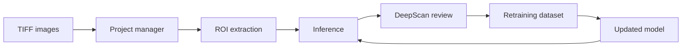

# AbyssEye

<p align="center">
  <strong>TIFF microscopy image management, ROI extraction, DeepScan review, and retraining preparation in one web app.</strong>
</p>

<p align="center">
  <a href="docs/manual.md">User Manual</a> ·
  <a href="docs/architecture.md">Architecture</a> ·
  <a href="docs/deployment.md">Deployment</a> ·
  <a href="CONTRIBUTING.md">Contributing</a> ·
  <a href="SECURITY.md">Security</a>
</p>

<p align="center">
  
  
  
  
  
</p>

## Why AbyssEye

AbyssEye is developed as a public OSS tool based on the microscopy cell-recognition workflow described in Nishimura et al., "[Deep learning for microbial life detection in deep subseafloor samples: objective cell recognition](https://doi.org/10.1038/s41598-025-29239-0)," *Scientific Reports* 15, Article 45574 (2025).

The tool is built for microscopy workflows where image ingestion, model inference, human review, and retraining data preparation need to stay connected. It keeps projects, TIFF files, ROI databases, model selection, realtime camera workflows, manual label correction, and exportable retraining datasets in one operator-facing interface.

The repository contains the FastAPI backend, the Vite/React frontend, and Docker deployment files. It does **not** include pretrained models, TIFF images, SQLite databases, retraining outputs, or user-generated project data.

## Highlights

- Research-aligned workflow for TIFF microscopy image ingestion, ROI extraction, inference review, and retraining preparation.
- Human-in-the-loop DeepScan review for correcting ROI labels and preserving review results in project databases.
- Local-first model and data handling: runtime TIFFs, SQLite databases, uploaded models, and retraining outputs stay outside Git.
- Browser-based operator interface backed by FastAPI endpoints and documented OpenAPI/Swagger pages.
- Docker deployment files for controlled local or trusted-network operation.

## Research Basis

The reference paper presents a two-step approach for microbial cell recognition in particle-rich subseafloor sediment samples: color-adaptive detection of green-fluorescent candidate particles followed by classifier-based review of cropped candidates. AbyssEye is intended to make this kind of microscopy image management, review, and retraining preparation easier to run and maintain in an operator-facing web workflow.

Reference:

- Tomoya Nishimura et al., "Deep learning for microbial life detection in deep subseafloor samples: objective cell recognition," *Scientific Reports* 15, 45574 (2025). DOI: [10.1038/s41598-025-29239-0](https://doi.org/10.1038/s41598-025-29239-0)

## What It Does

| Stage | Capability |
| --- | --- |
| Project setup | Organize TIFF microscopy images by project and workflow type. |
| Upload and realtime ingest | Upload single TIFF images, same-field folders, or receive images from watcher scripts. |
| ROI extraction | Extract ROI records into SQLite-backed project databases. |
| Model inference | Select, upload, activate, and compare inference models. |
| DeepScan review | Review ROI results, add manual labels, and correct ROI records. |
| Retraining preparation | Export reviewed project data and optionally run local retraining workflows. |



## Repository Layout

```text
backend/             FastAPI application
frontend/            React frontend
docker/              Docker Compose, Traefik, and Nginx deployment files
docs/                User, architecture, deployment, and publication docs
models/              Local model directory; contents are ignored by Git
```

Runtime artifacts are intentionally excluded from Git. Keep local `.tif`, `.db`, `.zip`, `.keras`, retraining runs, uploaded models, and generated caches out of commits.

By default, local runtime data is written under `backend/app/` for backward compatibility. Set `ABYSSEYE_DATA_DIR` to move generated data outside the source tree.

## Requirements

- Python 3.11
- Node.js 20 or later
- npm

TensorFlow support depends on Python and platform compatibility. Python 3.11 is the recommended backend runtime.

## Quick Start

Start the backend:

```bash
python3.11 -m venv venv
source venv/bin/activate
pip install -r backend/requirements.txt
ABYSSEYE_DATA_DIR=./data python backend/main.py
```

Start the frontend in another terminal:

```bash
cd frontend
npm ci
npm run dev
```

Open:

- Frontend: `http://localhost:3000`
- API docs: `http://localhost:8000/api/v1/docs`

If the backend port is changed, pass the same port to the frontend:

```bash
APP_PORT=8001 python backend/main.py
cd frontend
VITE_BACKEND_PORT=8001 npm run dev
```

For deployments that need a fixed API URL, set `VITE_API_BASE_URL` during the frontend build:

```bash
cd frontend
VITE_API_BASE_URL=https://example.org/api/v1/ npm run build
```

## Configuration

| Variable | Purpose |
| --- | --- |
| `ABYSSEYE_DATA_DIR` | Runtime data root for generated TIFFs, SQLite databases, caches, and retraining files. |
| `ABYSSEYE_MODELS_DIR` | Directory for uploaded or locally provided TensorFlow/Keras models. |
| `ABYSSEYE_CORS_ORIGINS` | Comma-separated browser origins allowed to call the backend. Defaults to local Vite origins. |
| `ABYSSEYE_FRONTEND_LOCK` | Keep the backend paired to the first non-local frontend client by default. Set to `0` to disable. |
| `ABYSSEYE_FRONTEND_CLIENT_IP` | Explicitly allow one frontend client IP when using the frontend lock. |
| `VITE_BACKEND_PORT` | Frontend build/dev fallback for constructing `http(s)://host:port/api/v1/`. |
| `VITE_API_BASE_URL` | Explicit frontend API base URL; overrides `VITE_BACKEND_PORT`. |

## Quality Checks

Run these before publishing changes or preparing a conference demo:

```bash
python3 -m compileall backend
cd frontend
npm run lint
npm run build
```

## Docker Deployment

Copy and edit the deployment environment file:

```bash
cp docker/.env.example docker/.env
```

Then build and start the stack:

```bash
docker compose -f docker/compose.yaml --env-file docker/.env up -d --build
```

The Compose stack is designed for controlled environments. Before exposing it outside a trusted network, review authentication, upload limits, model/data handling, operational logging, retention, and incident response.

## Documentation

| Document | Purpose |
| --- | --- |
| [User Manual](docs/manual.md) | Operator workflow and troubleshooting. |
| [Architecture](docs/architecture.md) | Backend/frontend module map and data flow. |
| [Deployment Guide](docs/deployment.md) | Local and Docker deployment notes. |
| [Publication Checklist](docs/publication-checklist.md) | Steps for copying into an official public repository. |
| [OSS Readiness Notes](docs/oss-readiness.md) | Current release blockers and cleanup notes. |
| [Contributing](CONTRIBUTING.md) | Development setup and contribution rules. |
| [Security Policy](SECURITY.md) | Security reporting and deployment assumptions. |

## Models and Data

Place local models under `models/` or upload them through the model manager. Model files are ignored by Git by default.

Do not commit:

- TIFF images or generated PNGs from microscopy data
- SQLite databases
- Uploaded model files or pretrained weights
- Project export ZIPs
- Retraining uploads or run outputs
- Absolute local paths from a developer workstation
- Logs containing sample names, private hostnames, or internal network details

## Contributors
- Research supervisor: Yuki MORONO (morono@jamstec.go.jp)
- Yunosuke Ikeda (d263826@hiroshima-u.ac.jp)
- Gashu Hayashi (m251284@hiroshima-u.ac.jp)
- Kouta Honjo (m256844@hiroshima-u.ac.jp)

## Citation

If you use AbyssEye in academic work, cite both this repository and the research paper that motivates the workflow:

- Tomoya Nishimura et al., "Deep learning for microbial life detection in deep subseafloor samples: objective cell recognition," *Scientific Reports* 15, 45574 (2025). DOI: [10.1038/s41598-025-29239-0](https://doi.org/10.1038/s41598-025-29239-0)

A machine-readable citation file is available at [CITATION.cff](CITATION.cff).

## Publication Status

This source tree is intended for public OSS publication and conference presentation. The repository already includes public-facing README content, contribution guidance, security guidance, CI checks, Docker files, and runtime-artifact exclusions.

Before treating the repository as a reusable official release, the project owner should close these decisions:

- Add an approved OSS `LICENSE` file.
- Confirm copyright holder, years, and attribution text.
- Confirm redistribution rights for source code, UI assets, bundled documentation, and model/data workflows.
- Decide whether public deployments are supported or explicitly limited to local/trusted networks.
- Replace the temporary vulnerability-reporting note in `SECURITY.md` with the approved official contact route.
- Add official maintainer/contact information.

See [docs/oss-readiness.md](docs/oss-readiness.md) for the current release-readiness notes.
