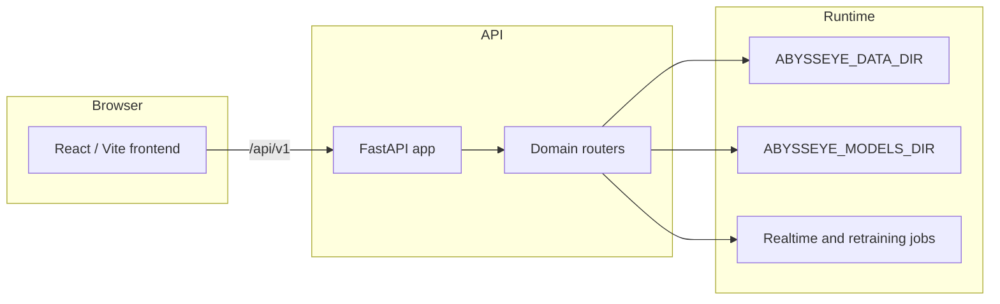

# Architecture

This document gives maintainers and new contributors a quick map of AbyssEye.

## Runtime Shape

AbyssEye is split into three main parts:

- `backend/`: FastAPI application for TIFF storage, ROI extraction, inference, DeepScan review, realtime uploads, and retraining jobs.
- `frontend/`: Vite/React application for project management and review workflows.
- `docker/`: Docker Compose deployment with Traefik, the backend API, and an Nginx-served frontend build.

The backend exposes API routes under `/api/v1`. The frontend reads the backend base URL from `frontend/src/config.ts`, with `VITE_API_BASE_URL` for explicit deployments and `VITE_BACKEND_PORT` as the local/Docker fallback.

## Backend Modules

- `app/app.py`: FastAPI app construction, CORS, frontend pairing guard, route registration, and built frontend serving.
- `app/paths.py`: Runtime path roots controlled by `ABYSSEYE_DATA_DIR` and `ABYSSEYE_MODELS_DIR`.
- `app/tiff_manager/`: Single TIFF upload, list, download, and delete.
- `app/tiff_manager_bulk/`: Project/folder upload, ROI extraction, inference summaries, export ZIPs, cell count outputs, and extraction tuning.
- `app/roi_extract/`: ROI extraction service and image-processing module.
- `app/inference/`: Model discovery, upload, active model selection, and prediction.
- `app/deepscan/`: ROI review, manual labels, manual ROI additions, and image download helpers.
- `app/realtime/`: Realtime TIFF upload, watch-script generation, current image status, and project watch jobs.
- `app/retraining/`: Retraining archive handling, job orchestration, metrics, artifacts, and model promotion.
- `app/databases/`: Database listing, overview, records, and downloads.

## Data Layout

Runtime data is intentionally excluded from Git. By default, legacy local development writes under `backend/app/`; operators should set `ABYSSEYE_DATA_DIR` for cleaner deployments.

Typical runtime directories include:

- `databases/`
- `realtime_cache/`
- `realtime_databases/`
- `realtime_tiff/`
- `retraining_uploads/`
- `retraining_runs/`
- `tiff_manager_bulk/`

Model files live under `models/` by default, or under `ABYSSEYE_MODELS_DIR` when configured.

## Main Workflows

1. Upload TIFFs into a project or receive them through the realtime endpoint.
2. Extract ROIs into SQLite-backed records.
3. Run inference with the active model.
4. Review and correct results in DeepScan.
5. Export project data or prepare retraining datasets.
6. Optionally run local retraining and promote the resulting model.

## Security Boundary

The application sanitizes many filenames and keeps runtime artifacts out of Git, but it is not a hardened multi-tenant SaaS application. Public deployments should add authentication, authorization, upload limits, operational logging, and retention policies before exposure beyond a trusted network.
